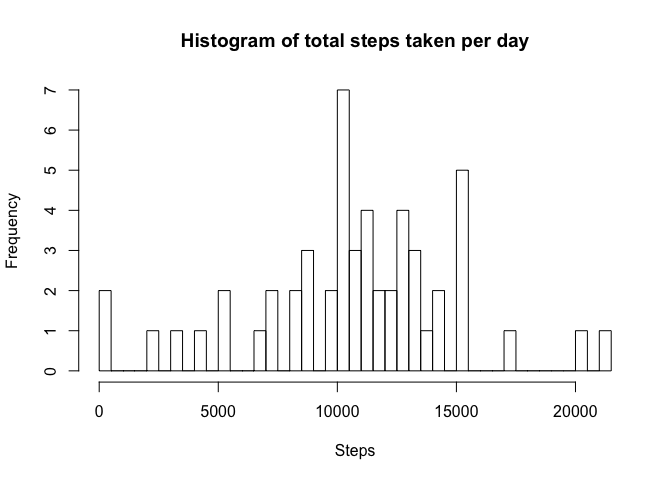
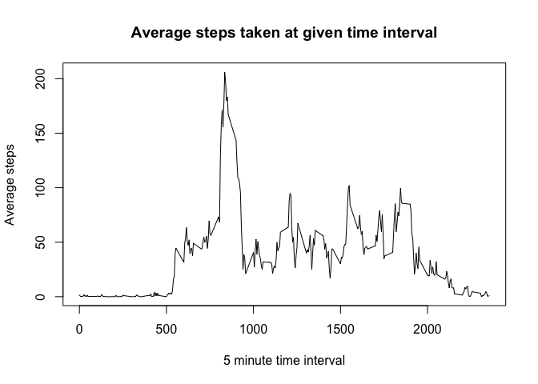
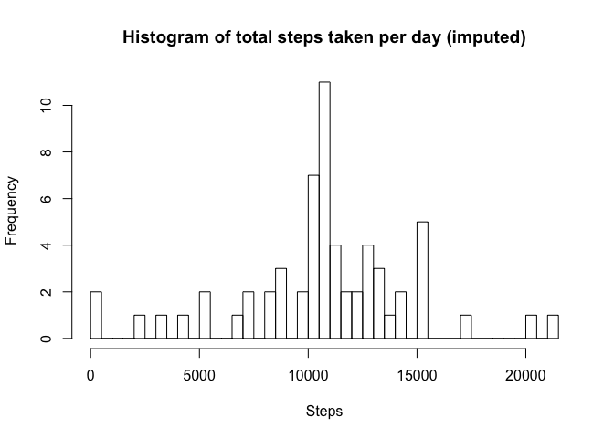
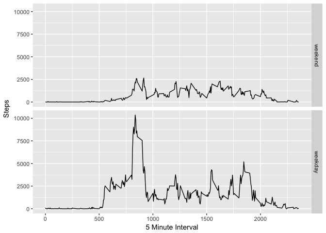

# Reproducible Research: Peer Assessment 1


## 1. Loading and Preprocessing

```r
dat <- read.csv("./activity.csv")

filtered_dat <- dat %>% 
     filter(is.na(steps) == FALSE) %>% 
     group_by(date) %>% 
     summarize(steps = sum(steps))
```


## 2. Steps per day

```r
total_steps <- filtered_dat %>% summarize(steps = sum(steps))
hist(x = filtered_dat$steps,
     breaks = 50, 
     main = "Histogram of total steps taken per day",
     xlab = "Steps")
```

<!-- -->

## 3. Mean and Median of steps per day


```r
mean_steps <- mean(filtered_dat$steps)
median_steps <- median(filtered_dat$steps)
```
  
The mean of daily steps is: 10,766.19  
The median of daily steps is: 10,765  


## 4. Average daily pattern for time series plot

```r
steps_by_interval <- dat %>%
     filter(is.na(steps) == FALSE) %>%
     group_by(interval) %>%
     summarize(avg_steps = mean(steps), tot_steps = sum(steps), cnt = n())

plot(x = steps_by_interval$interval, 
     y = steps_by_interval$avg_steps, type = "l",
     xlab = "5 minute time interval",
     ylab = "Average steps",
     main = "Average steps taken at given time interval")
```

<!-- -->

##5. 5 minute interval with maximum number of steps

```r
data_row <- steps_by_interval %>% filter(avg_steps == max(avg_steps)) 
```
  
  The 5 minute interval on average across all days in the set that contains the maximum number of steps is: 835

##6. Code to describe and impute missing data  

```r
missing_data = count(filter(dat, is.na(dat$steps) == TRUE))
```
  
  There are 2,304 missing data items. To impute the values of the missing data, we will use the mean of the 5 minute interval.

```r
#Replace missing data with mean of that time interval
#Separate missing data from complete data
imputed_dat <- dat %>% filter(is.na(steps) == FALSE)
missing_dat <- dat %>% filter(is.na(steps) == TRUE)

#Set missing data equal to mean of that interval
missing_dat <- full_join(missing_dat, steps_by_interval, by = "interval") %>%
               transmute(steps = avg_steps, 
                         date = date,
                         interval = interval)

#Recombine missing data with good data
imputed_dat <- rbind(imputed_dat, missing_dat)
```
##7. Histogram of total number of steps with missing data imputed  


```r
imputed_steps_per_day <- imputed_dat %>%
     group_by(date) %>%
     summarize(steps = sum(steps))

imputed_mean = mean(imputed_steps_per_day$steps)
imputed_median = median(imputed_steps_per_day$steps)
     
hist(x = imputed_steps_per_day$steps,
     breaks = 50, 
     main = "Histogram of total steps taken per day (imputed)",
     xlab = "Steps")
```

<!-- -->
  
  The mean of steps per day using imputed data is 10,766.19  
  The median of steps per day using imputed data is 10,766.19  
  The mean and median are basically the same as without the imputed data. Imputing the data had no impact on the mean or median, since we were replacing missing data with the mean of the particular interval.
  
##8. Panel plot of average number of steps comparing weekday and weekend

```r
#Using imputed data
weekends <- c("Saturday", "Sunday")
imputed_dat$weekday <- factor(weekdays(as.Date(imputed_dat$date)) %in% weekends, 
                       labels = c('weekend', 'weekday'), 
                       levels=c(TRUE, FALSE))


steps_by_interval_wk <- imputed_dat %>%
     group_by(interval, weekday) %>%
     summarize(tot_steps = sum(steps), cnt = n())

head(steps_by_interval_wk)
```

```
## Source: local data frame [6 x 4]
## Groups: interval [3]
## 
##   interval weekday   tot_steps   cnt
##      <int>  <fctr>       <dbl> <int>
## 1        0 weekend   3.4339623    16
## 2        0 weekday 101.3018868    45
## 3        5 weekend   0.6792453    16
## 4        5 weekday  20.0377358    45
## 5       10 weekend   0.2641509    16
## 6       10 weekday   7.7924528    45
```

```r
g <- ggplot(steps_by_interval_wk, aes(interval, tot_steps)) + 
     geom_line() + 
     facet_grid(weekday ~ .) + 
     xlab("5 Minute Interval") + 
     ylab("Steps")
print(g)
```

<!-- -->
